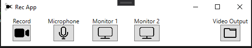

# RecApp
A snipping tool inspired screen recorder.

## Features
Croppable video recording  
Supportes vertical and horizontal screen orientations 
Microphone toggle  
Up to 4 displays handled  
Minimalistic UI  

### TODO/Current Issues
Quality selection dropdown - Update video encoder bitrate to be multiplied by 1, 2, or 3  
Mouse click options dropdown - possible color selector  
Overlay - allow png files to be overlaid on video  

 

This is built with Windows Presentation Forms via .NET Framework and leverages ScreenRecorderLib (https://github.com/sskodje/ScreenRecorderLib)
